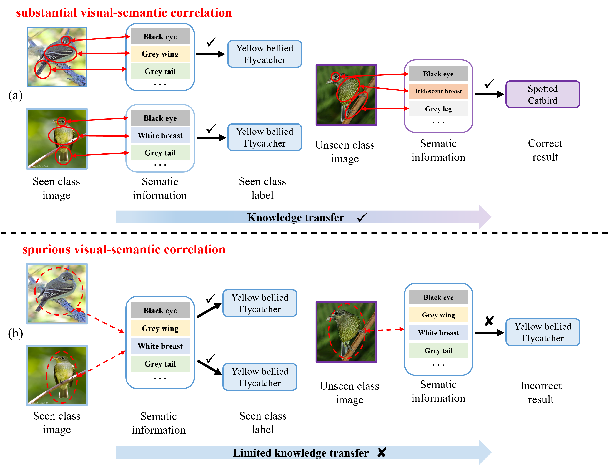
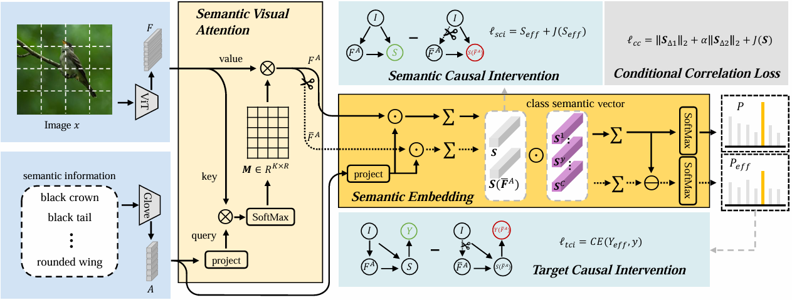

<div align="center">
<h1> CVsC [ACM MM'24]🎉 </h1>
<h3> Causal Visual-semantic Correlation for Zero-shot Learning </h3>

[Shuhuang Chen]()<sup>1 *︎</sup> ,[Dingjie Fu](https://github.com/DingjieFu)<sup>1 *︎</sup> ,[Shiming Chen](https://shiming-chen.github.io/)<sup>2</sup> ,[Shuo Ye](https://github.com/SYe-hub)<sup>1</sup> ,[Wenjin Hou](https://github.com/Houwenjin)<sup>1</sup> ,[Xinge You](https://bmal.hust.edu.cn/EN.htm)<sup>1 ✉</sup>

<sup>1</sup> Huazhong University of Science and Technology, <sup>2</sup> Mohamed bin Zayed University of AI 
<br>
(*︎) co-first author,  (✉) corresponding author
<br>
</div>


## 🤓Overview
<details>
  
### • Abstract

<div align="center">  </div>

### • Pipeline
<div align="center"> </div>

### • Main Results
| Dataset | Acc(CZSL) | U(GZSL) | S(GZSL) | H(GZSL) |
| :-----: | :-----: | :-----: | :-----: | :-----: |
| CUB | 79.1 | 72.4 | 78.4 | 75.3 |
| SUN | 71.5 | 61.9 | 47.6 | 53.8 |
| AWA2 | 73.1 | 68.0 | 87.0 | 76.4 |

</details>


## 💪Getting Started
<h3> • Requirements </h3>

```
git clone git@github.com:DingjieFu/CVsC.git
cd CVsC
conda create -n CVsC python=3.8.18
conda activate CVsC
pip install -r requirements.txt
```
<h3> • Data Preparation </h3>

🌟 **Note: You can download the datasets by following the instructions in the '[dataset](https://github.com/DingjieFu/CVsC/tree/main/data/dataset)' directory**
```
CVsC/
├── data
│   ├── attribute
│   ├── dataset
│   │   ├── AWA2
│   │   │   ├── Animals_with_Attributes2
│   │   │   │   ├── JPEGImages
│   │   │   │   └── ...
│   │   ├── CUB
│   │   │   ├── CUB_200_2011
│   │   │   │   ├── images
│   │   │   │   └── ...
│   │   ├── SUN
│   │   │   ├── images
│   │   │   └── ...
│   │   ├── xlsa
│   │   │   ├── data
│   │   │   │   ├── AWA2
│   │   │   │   └── ...
│   ├── w2v
│   └── ...
├── extract_feature
└── ...
```
<h3> • Model Training </h3>

**Using extracted features**
```
python extract_feature/extract_feature_map_ResNet_101.py --dataset CUB --inputsize 224 --batch_size 500
python train.py --dataset CUB --backbone Resnet --inputsize 224 # after finishing extracting features
```

**End to end training**
```
python train.py --dataset CUB --backbone Resnet --inputsize 224 --is_end2end
```
## 📑Acknowledgement
The implementation is based on the repo [DAZLE](https://github.com/hbdat/cvpr20_DAZLE), thanks for their excellent works.
